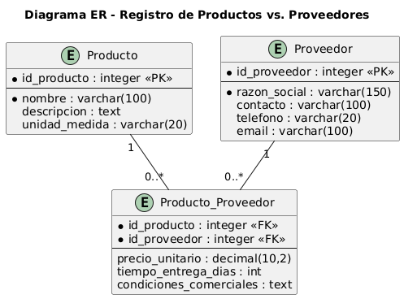

<p align="center">
  
</p>

<h1 align="center">Fashion entERPrise</h1>

<p align="center">
  ERP de escritorio para la gestión integral de un distribuidor de ropa: inventario, proveedores, clientes y recursos humanos.
</p>

<p align="center">
  
  
  
  
</p>

---

## 📋 Descripción

**Fashion entERPrise** es un sistema ERP (Enterprise Resource Planning) construido en **C# WinForms** pensado para centralizar los procesos operativos de una empresa distribuidora de ropa: control de **inventario**, **proveedores**, **clientes (CRM)** y **personal (RRHH)**, con el objetivo de dar trazabilidad y visibilidad en tiempo real sobre el estado del negocio.

El proyecto nace como ejercicio de diseño de software aplicando una **arquitectura en capas** (presentación, negocio, datos y entidades) y documentación arquitectónica siguiendo el modelo **arc42**.

## ✨ Módulos principales

| Módulo | Pantalla | Descripción |
|---|---|---|
| 🏠 Inicio | `FrmInicio` | Punto de entrada y navegación general del sistema. |
| 📦 Inventario | `FrmInventario` | Alta, consulta y control de productos en bodega. |
| 🧾 Proveedores | `FrmCRUDProveedor` | Gestión (CRUD) de proveedores asociados a las compras. |
| 👥 CRM | `FrmCRM` | Gestión de clientes de la tienda. |
| 🧑‍💼 RRHH | `FrmRRHH` | Gestión de empleados de la empresa. |

## 🏗️ Arquitectura

El sistema está organizado en 4 proyectos (capas) dentro de la misma solución de Visual Studio:

```
Fashion_ERP.sln
├── P_FashionERP/     → Capa de Presentación (formularios WinForms)
├── capaNegocio/       → Capa de Negocio (reglas y validaciones, clases N_*)
├── capaDatos/         → Capa de Datos (acceso a SQL Server, clases D_*)
└── capaEntidad/        → Capa de Entidad (modelos / DTOs, clases E_*)
```

- **capaEntidad**: define las entidades del dominio (`E_Cliente`, `E_Empleado`, `E_Inventario`, `E_Proveedor`).
- **capaDatos**: encapsula el acceso a la base de datos SQL Server (`D_Cliente`, `D_Empleado`, `D_Inventario`, `D_Proveedor`).
- **capaNegocio**: contiene la lógica de negocio y validaciones (`N_Cliente`, `N_Empleado`, `N_Inventario`, `N_Proveedor`).
- **P_FashionERP**: interfaz de usuario de escritorio (WinForms), consume la capa de negocio.

> La documentación de arquitectura (modelo **arc42**) con los diagramas C1 (contexto), C2 (contenedores), despliegue y secuencia se encuentra en la raíz del repositorio (`01_introduction_and_goals.md` → `10_glossary.md`) y en formato fuente `.puml` para quien quiera regenerarlos con PlantUML. Esos documentos describen además la visión objetivo del proyecto (evolución hacia API + frontend web); la implementación actual es el cliente de escritorio WinForms aquí incluido.

### Modelo Entidad-Relación



## 🛠️ Tecnologías

- **Lenguaje:** C#
- **Framework:** .NET Framework 4.7.2
- **UI:** Windows Forms
- **Base de datos:** Microsoft SQL Server
- **Librerías:** [FontAwesome.Sharp](https://www.nuget.org/packages/FontAwesome.Sharp) (iconografía), NuGet (`packages.config`)
- **Documentación de arquitectura:** arc42 + PlantUML
- **Control de versiones:** Git / GitHub

## 🚀 Puesta en marcha

### Requisitos previos

- Visual Studio 2022 o superior con la carga de trabajo **.NET desktop development**.
- .NET Framework 4.7.2 (Developer Pack).
- Microsoft SQL Server (local o remoto) para la base de datos.

### Pasos

1. Clona el repositorio:
   ```bash
   git clone https://github.com/Cachureto/Fashion-entERPrise.git
   ```
2. Abre `Fashion_ERP.sln` en Visual Studio.
3. Restaura los paquetes NuGet (Visual Studio lo hace automáticamente al compilar, o clic derecho sobre la solución → **Restaurar paquetes NuGet**).
4. Configura la cadena de conexión a tu instancia de SQL Server en el `App.config` del proyecto `P_FashionERP` (y en los `app.config` de `capaDatos`).
5. Compila y ejecuta (F5) con `P_FashionERP` como proyecto de inicio.

## 📁 Estructura del repositorio

```
Fashion_ERP/
├── P_FashionERP/        # Proyecto de presentación (WinForms)
├── capaNegocio/          # Lógica de negocio
├── capaDatos/            # Acceso a datos
├── capaEntidad/           # Entidades del dominio
├── conceptuales/          # Diagramas de arquitectura (PlantUML + PNG)
├── Fashion entERPrise_pngs/ # Recursos gráficos (logo, iconos)
├── *.md                   # Documentación arc42
└── Fashion_ERP.sln        # Solución de Visual Studio
```

## 🗺️ Roadmap

- [ ] Migrar la capa de datos a un ORM (Entity Framework / Dapper).
- [ ] Módulo de facturación electrónica.
- [ ] Reportes e indicadores (KPIs) de ventas e inventario.
- [ ] Evaluar evolución hacia una API + frontend web, conforme a la visión descrita en la documentación arc42.

## 🤝 Contribuciones

Las sugerencias y mejoras son bienvenidas. Si quieres contribuir:

1. Haz un fork del repositorio.
2. Crea una rama para tu feature (`git checkout -b feature/nueva-funcionalidad`).
3. Haz commit de tus cambios y abre un Pull Request.

## 📄 Licencia

Este proyecto no tiene una licencia definida todavía. Si deseas usarlo o distribuirlo, contacta al autor.
